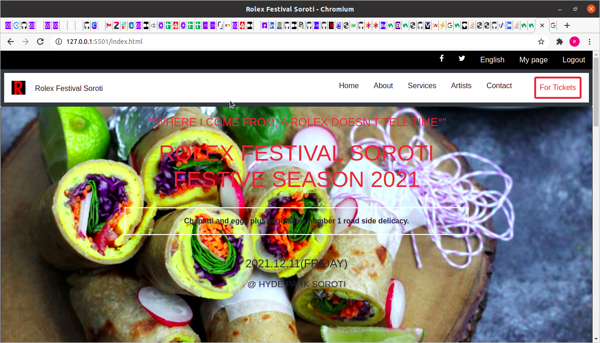

# e-conference
# Capstone Event Page 
 This is a project of a Cindy Shin's Global Summit page. 

 ## Preview
  
 
 ## Built With 
 - HTML 
 - CSS 
 - Bootstrap
 - Font awesome icons 
 
 ## Live Demo 
 [LIVE VERSION](https://raw.githack.com/Genius8/e-conference/feature/index.html) 

 ## Requirements 
 - Use semantic HTML tags. 
 - Use HTML elements box model (margin, padding, width, height). 
 - Use industry-standard tools (flexbox, bootstrap) to place elements in the page. 
 - Ability to create UIs adaptable to different screen sizes using media queries. 
 - Apply front-end best practices. 
 - Ability to create UIs adjusted to given designs. 
 - Strong English written and verbal communication. 
 - Ability to communicate information effectively to technical and non-technical people. 
 - Ability to translate business requirements into software solutions. 
 - Ability to work well in a fast-paced environment under deadlines. 
 - Ability to perform tasks and complete projects with minimal supervision. 

## CDNs
- https://fontawesome.com/icons

## Steps For Installation
- After cloning this repo, git clone [repo](git@github.com:Genius8/e-conference.git), cd into e-conference
- Open the index.html file in your favourite browser, and  there you are!!!

 ## Authors 👤 
 **OEM⭐ 
 ## Twitter

- Twitter: [@twitterhandle](https://twitter.com/erasmus_okiror)

## Github

 - Github: [@githubhandle](https://github.com/Genius8)

 ## :handshake: Contributing

Contributions, issues and feature requests are welcome!

## Show your support

Give a :star:️ if you like this project!

## Acknowledgments

- Hat tip to anyone whose code was used
- Inspiration
- etc

## :memo: License

This project is [MIT](lic.url) licensed.
